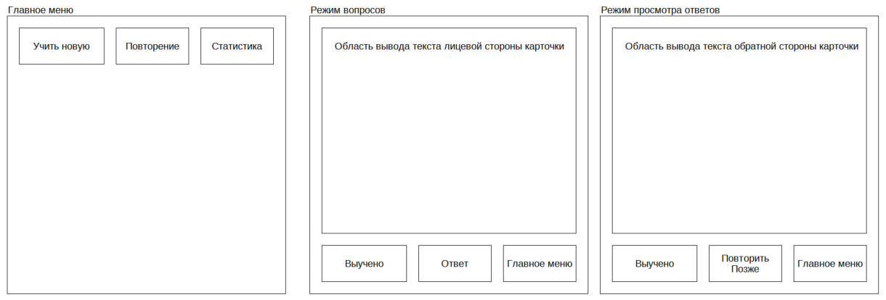

# Flashcards 
Учебный проект курса Kotlin Developer

Flashcards - это инструмент для улучшения запоминания информации, которую удобно представлять в виде карточек с лицевой и обратной стороной.
Например, это могут быть термины и их определения, вопросы и ответы, слова и их перевод при изучении иностранных языков и т.п. 
Основные задачи приложения:
- показывать пользователю карточки, занесенные в систему;
- регистрировать результат самопроверки пользователя;
- подбирать карточки в соответствии с правилами, способствующими лучшему запоминанию;
- по запросу показывать обратную сторону карточки, на которой размещена запоминаемая информация;
- показывать пользователю статистику и прогресс изучения карточек.

## Визуальная схема фронтенда

## Документация

1. Маркетинг
   1. [Целевая аудитория](./docs/01-marketing/target-audience.md)
   2. [Конкурентный анализ](./docs/01-marketing/concurrency.md)
   3. [Пользовательские истории](./docs/01-marketing/user-stories.md) 
2. DevOps
   1. [Схема инфраструктуры](./docs/02-devops/01-infrastruture.md)
   2. [Схема мониторинга](./docs/02-devops/02-monitoring.md)
3. Тесты
4. Архитектура
   1. [Компонентная схема](./docs/04-architecture/01-arch.md)
   2. [Интеграционная схема](./docs/04-architecture/02-integration.md)
   3. [Описание API](./docs/04-architecture/03-api.md)
